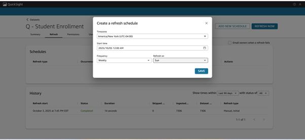
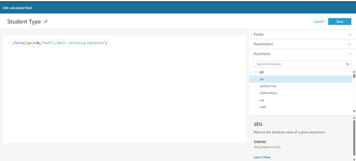

# AWS QuickSight: College Student Enrollment Analysis

## Project Overview

Business intelligence project using AWS QuickSight to analyze student enrollment data and provide actionable insights to improve professor evaluation scores while avoiding cost increases.

**Key Question:** How can Regional Community College improve professor evaluations without increasing course costs?

## Business Context

- **Client:** Regional Community College Board of Directors
- **Challenge:** Understanding what drives positive student experience and professor effectiveness
- **Goal:** Identify improvement opportunities while maintaining affordable education

## Tools & Technologies

- **AWS QuickSight** - Dashboard creation and visualization
- **Amazon Q** - Natural language querying
- **Data Analysis** - Student enrollment, course evaluations, academic records

## Key Deliverables

### 1. Dataset Preparation
- Configured refresh schedules
- Created calculated fields (Student Type classification)
- Renamed and structured data fields

### 2. Interactive Dashboards
Created visuals analyzing:
- Student enrollment by major and academic year
- Student type distribution (Youth vs Adult Continuing Education)
- Professor evaluation scores
- Course costs and evaluations
- Top and bottom performing courses

### 3. Data Story & Recommendations

**Key Findings:**
- Specialized courses correlate with highest evaluation scores
- Course cost relates to perceived quality (higher cost = higher evaluations)
- Class size has minimal impact on evaluation scores
- Top 5 rated courses: Environmental Ethics, Python 2, Advanced Biology, etc.

**Recommendations for Board of Directors:**

1. **Increase Student Engagement**
   - Implement interactive teaching methods
   - Add peer learning in larger classes
   - Use real-world group projects

2. **Faculty Development**
   - Encourage professors with lower scores to adopt practices from top-rated faculty (Jill, Andrew)
   - Specialize professors in fewer courses where they excel

3. **Course Content Optimization**
   - Review and update course structures regularly
   - Add current real-world scenarios
   - Apply technology without additional costs

4. **Strategic Enrollment**
   - Increase enrollment by 20% in top-rated courses (Environmental Ethics, Python 2)
   - Expected impact: 0.9% overall increase in evaluation scores
   - Do not reduce costs for high-performing courses

## Project Screenshots

### Dataset Configuration

### Analysis & Visuals

### Dashboard

### Scenario Analysis

### Data Story

## Skills Demonstrated

- Business intelligence dashboard design
- Data preparation and transformation
- Natural language querying (Amazon Q)
- Data visualization best practices
- Scenario-based analysis
- Executive-level data storytelling
- Strategic business recommendations

## Project Details

**Duration:** Part of AWS Business Intelligence Engineer Nanodegree  
**Certification:** AWS Certified Business Intelligence Engineer

---

## About This Project

This project was completed as part of the AWS Business Intelligence Engineer certification program. It demonstrates practical application of AWS QuickSight for business analytics, combining technical skills with business acumen to deliver actionable insights.

**Note:** Screenshots are from the AWS QuickSight interface. The actual dashboards are hosted on AWS and not publicly accessible due to platform limitations.

## Connect

Questions about this project? Let's connect!

💼 [LinkedIn](https://www.linkedin.com/in/samia-ahmedusa/)  
📧 samia.ahmed189@gmail.com
